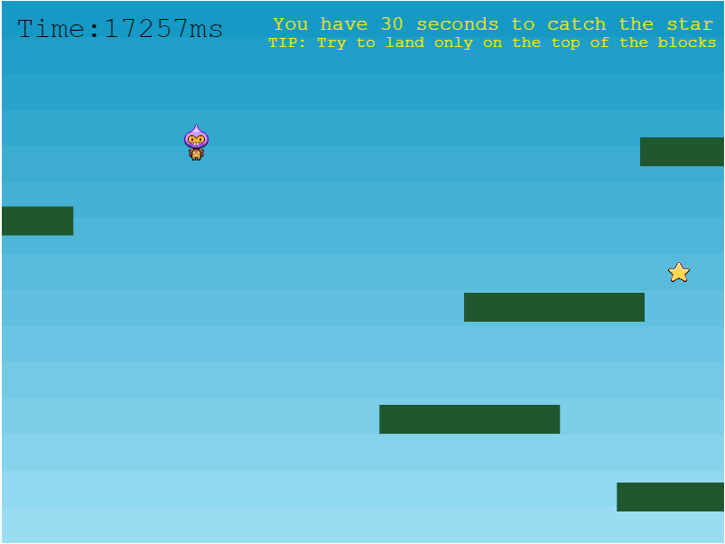
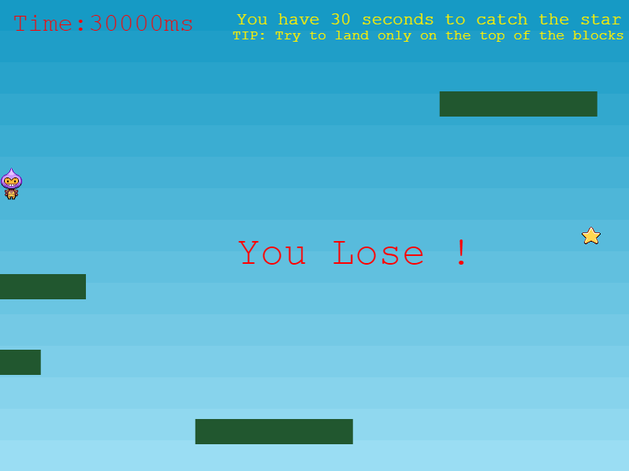

# Platform Runner
Simple platformer using the Phaser library. 

The goal is simple: ___catch the gold star by jumping from platform to platform___. Be quick, you only have 30 seconds ! Use the __SPACE__ button to jump, and the __ARROW__ buttons to navigate (explore further to find hidden buttons).

## Screenshot

<!--  -->
<!--  -->

## Instructions
In order to run this game:
1. Clone/download this repository.
2. At the base folder, run a local http server. This can easily be done if you have Python 3 installed. In your terminal/CMD, run: 
`
python -m http.server
`
or 
`
python3 -m http.server
`
depending on your system.
3. Launch your browser with the localhost and port number returned by the command above. For example `http://localhost:8000/`.
4. Enjoy (and reload the page if you want to play some more)!

## Ressources
- [Phaser](https://phaser.io/)
- [Mozilla](https://developer.mozilla.org/en-US/docs/Learn/Common_questions/set_up_a_local_testing_server)

## Licence
GPL Licence
